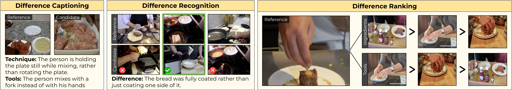

<div align="center">
  
</div>

# Step differences dataset
This repo contains the data release for our CVPR24 paper:  
Step Differences in Instructional Video  
[Tushar Nagarajan](https://tushar-n.github.io/), [Lorenzo Torresani](https://ltorresa.github.io/home.html)  
[[arxiv]](https://arxiv.org/abs/2404.16222) [[openreview]](https://openreview.net/forum?id=3BxYAaovKr) 

## Annotations
The datasets for the three tasks can be found in the `data/` folder. Each file is a json file with one annotation per line. This data is used for zero-shot evaluation -- there are no training splits. Please see Sec. 4 in the paper for more information. Details about each dataset are below. 
- Difference Captioning (DiffCap): [`data/diffcap_dataset.jsonl`](data/diffcap_dataset.jsonl)
- Difference Recognition (DiffMCQ): [`data/diffmcq_dataset.jsonl`](data/diffmcq_dataset.jsonl)
- Difference Ranking (DiffRank): [`data/diffrank_dataset.jsonl`](data/diffrank_dataset.jsonl)

### Difference Captioning
The goal is to generate a textual description of the differences between two videos in a specific category (e.g., ingredients, tools). The annotation structure for each line is as follows:
```json
{
    "reference": "stqbYYDH4vg_334.04358_339.80214",
    "candidate": "vfxfLvrs-50_97.70276_109.4911",
    "category": "Ingredients",
    "text": [
        "The person chopped small red chili as opposed to long red chili",
        "The person diced the whole red chili rather than chopped only half of it"
    ]
}
```
Where
- `reference/candidate` refers to the specific HT100M video clip in the format `<video_uid>_<start_time>_<end_time>`.
- `category` is the difference category among ingredients, tools/equipment, techniques and visual differences.
- `text` is the the list of differences in the format "&lt;what happened in the target video&gt; instead of &lt;what was observed in the reference&gt;"

### Difference Recogniton
The goal is to select the correct video pair that matches the difference caption, from a list of candidate video pairs. The annotation structure for each line is as follows:
```json
{
    "difference": "The rib eye was seasoned all the way around instead of just the top part of it.",
    "category": "Technique",
    "options": [
        ["UY4Q7Drsh0w_82.98804_96.629", "A2cOC62Ui3o_265_294"],
        ["-dSL1P7MUHw_122.79905_141.76286", "48pUN8U_Ekw_73.85349_96.37585"],
        ["UFxKtiyPiyY_108.395_121.399", "XWzqkXJGYpU_184.99244_204.5"],
        ["glrijRGnmc0_246.79921_274.66563", "vwDbNixns_4_66.35833_77.7176"]
    ],
    "answer": ["-dSL1P7MUHw_122.79905_141.76286", "48pUN8U_Ekw_73.85349_96.37585"]
}
```
Where
- `difference` is the target difference caption.
- `options` is a list of pairs of video clips to select from of which one pair matches the difference caption above.
- `answer` is the correct pair of video clips that shows the difference.

### Difference Ranking
The goal is to rank video instances based on how different they are to a common reference video, in terms of a particular category of interest. The annotation structure for each line is as follows:
```json
{
    "reference": "jTdZwYbtA6c_487.44022_496.71816",
    "targets": [
        "HHk8yZO5VmA_138.81638_143.62094",
        "MXNjR7JoccA_144.88462_154.22698",
        "ErSXS6zVMqA_234.15126_238.19707",
        "Sfyg-EiwaPI_82.58371_87.08176"
    ],
    "category": "Ingredients",
    "scores": [5, 2, 0, 3]
}
```
Where
- `reference` is the common reference video clip.
- `targets` is a list of video clips to rank based on `category`.
- `scores` is a list of scores for how similar each target video is to the common reference (5=most similar). Ties are accounted for by the evaluation metric.

## Videos
The annotations are collected over keystep segments from the [HT-Step](https://github.com/facebookresearch/htstep) dataset, which in turn is collected over videos from [HowTo100M](https://www.di.ens.fr/willow/research/howto100m/). Follow instructions from the [official release](https://github.com/antoine77340/howto100m) to download videos from their urls. 


## Evaluation starter code
We provide reference evaluation code for the three tasks in `evaluation/run.py` along with model predictions to replicate the results in Table 1.

```
# Install requirements
pip install numpy jsonlines pycocoevalcap scipy

# Download stepdiff model predictions to predictions/
bash evaluation/download_predictions.sh

# Run evaluation for a particular task (e.g., diffcap, diffmcq, diffrank) 
python -m evaluation.run \
--gt_file data/diffcap_dataset.jsonl \
--pred_file predictions/stepdiff_diffcap_preds.jsonl \
--task diffcap
```

Note: Unfortunately, we are unable to release the automatically generated PairQA training data or training code. Complete details on how to generate and filter the training data can be found in Supp. S1 of the paper. Training can be set up in any popular Vision LLM codebase (e.g., LLaVa, VideoChat2). 

## License
This project is released under the CC-BY-NC 4.0 license, as found in the LICENSE file.

## Cite
If you find this repository useful in your own research, please consider citing:
```
@inproceedings{stepdiff,
    author = {Nagarajan, Tushar and Torresani, Lorenzo},
    title = {Step Differences in Instructional Video},
    booktitle = {CVPR},
    year = {2024}
}
```
